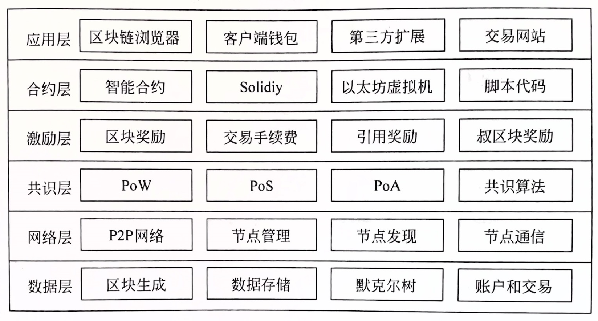
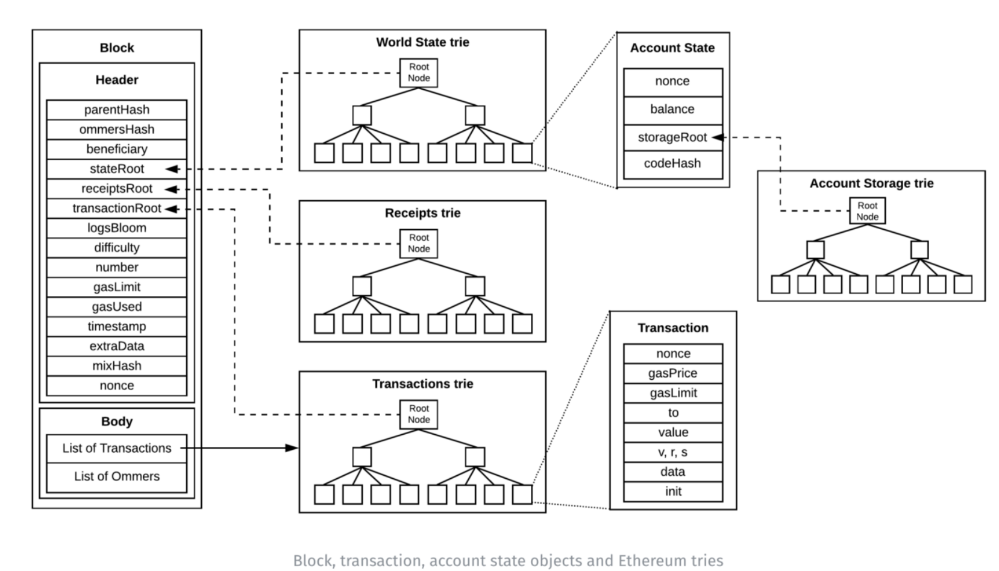
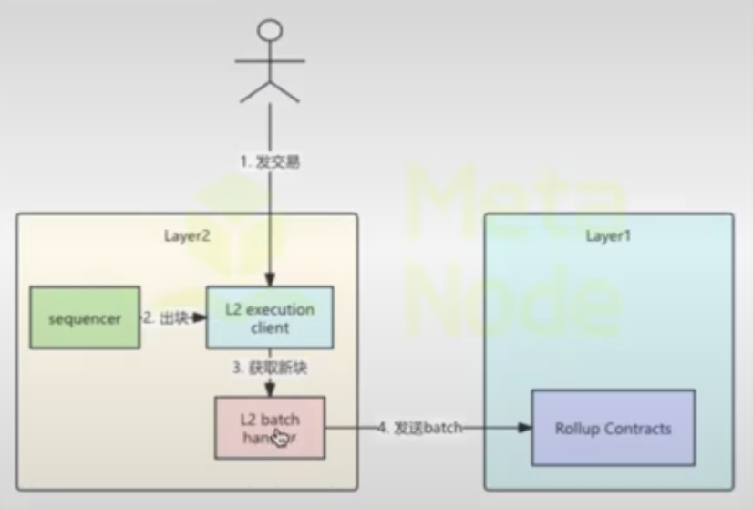
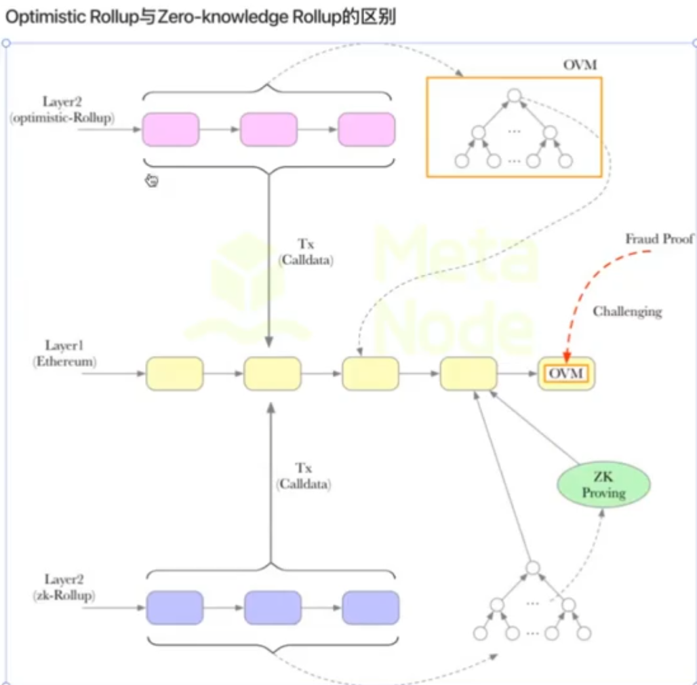
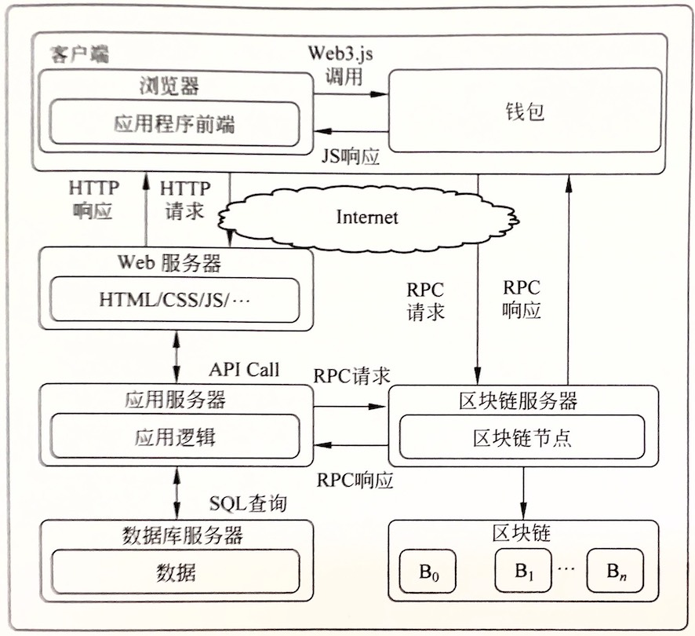

# 区块链
本质上讲区块链其实就是一种链式数据结构，通过时间顺序将数据块逐一连接形成，并且通过
密码学确保其不可篡改和不可伪造性。但从广义上讲它结合了链式结构/分布式共识/密码学原理/只能合约等
技术，提供全新的，分布式基础架构和计算平台。 

**公链：** 完全去中心化区块链。以BTC、以太坊为代表

**私链：** 仅向特定个人或者实体开放的区块链，每个节点权限由中心组织分配。优势在于速度和低成本

**联盟链：** 部分去中心化的区块链，允许多个组织之间进行数据交互。

## 核心技术

### 分布式账本 DLT
去中心化数据存储方式，允许多个节点进行分享、复制、同步。与传统分布式存储相比，
DLT通过共识机制具有更高的安全性、效率

### P2P网络
P2P即点对点网络，允许多个节点之间进行数据传输，无需中心机构。优势：快速且保障隐私、
数据容错性、稳定性

### 共识算法
在去中心化的系统中，需要用共识算法来维持节点的一致性。在区块链中，所有的账单以hash指针相连
，具体谁有记账的权力，由共识算法决定。  
**Proof of Work**：通过节点的计算能力来决定记账权。节点通过解决mining puzzles
找到nonce并生成符合目标阈值的hash值，从而获得记账权。

**Proof of Stake**：通过节点的投票权来决定记账权。持币的节点通过质押
一定的货币作为权益，通常情况下持有货币多的节点会获得记账权

**Delegated Proof of Stake**：民主集中式通过节点的投票权来决定记账权。
投票投出代表进行共识

**Proof of Authority**：通过节点的授权来决定记账权。
节点通过授权来获得记账权

- **BFT**：拜占庭。可能出现恶意节点时，如何保证一致性？
- **FLP理论**：在一个异步通信网络中，只要存在一个故障节点，就不存在一种完美的共识算法可以使所有节点达到一致。
所以现有的共识算法都是基于FLP找到适当的平衡来实现。
- **CAP**: 在任何分布式系统中，不可能同时实现以下三个特性
  - Consistency
  - Availability
  - Partition tolerance

### 密码算法
非对称加密、hash算法、编解码

# 主流区块链应用

# BTC
关键设计：P2P、DLT、PoW、最长链原则 
区块链每个区块都指向前一个区块的hash值而形成链。矿工通过解决mining puzzles获得记账权。
其中block header中有：
- version：版本号
- previousBlockHash：表示上一个block header使用sha-256算法计算得到的hash值
- merkleRoot: 表示这个区块所包含的所有transaction组建merkle tree后的根hash值
- timestamp：区块打包时间
- nonce：随机数
- nBits: 紧凑格式的target，由全网决定的一个阈值。每2016个区块，
nBits会自动更新。newTarget = oldTarget * ((lastBlockTime - firstBloackTime)/2016*10min)。且newTarget上下限乘以4，除以4
 
block body: traction data
 

## 挖矿过程
1. 打包交易：矿工从待确认的交易池中选择一部分交易或者不选择，打包进block body。每个区块最多1M，
理论上一个区块最多包含1M/250字节=4000个交易。通过手续费排序，选择手续费最大的交易。
尽可能打包最多的交易。
2. 构造coinbase：区块的第一比交易叫做coinbase。其中每笔交易都有inputs和outputs，inputs指其他交易的outputs。
coinbase的inputs为空，outputs指向矿工地址。确定好交易列表后，矿工可以统计出本区块交易费用。
3. 构造merkle root：对所有交易进行merkle tree构建，并计算merkle root。
4. 填充区块头：填充版本号、previousBlockHash、merkleRoot、时间戳、nonce。
5. Hash运算：通过sha-256D（双重sha-256）算法计算block header的hash值。
6. 验证结果：验证block header的hash值是否小于给定的阈值。如果符合，矿工讲整个区块
广播到网络中并开始挖下一个区块；如果不符合，则重新计算nonce并重新进行hash运算。
直到找到合适的nonce，并广播该区块。
合格的区块条件：sha-256D(block header) < F(nBits)

## UTXO： Unspent Transaction Output
比特币使用的一种创新的账户模型。要获取一个账户的余额需要，查询该账户的UTXO列表，并计算余额。
每个全节点都会保存所有账户的UTXO列表。
 

## 解决double spending
- UTXO：新的交易上链时，接收到此交易的节点会对其inputs进行验证。如果UTXO中存在未花费的output，则此交易合法。
- 区块时间戳：当一个用户将比特币发给另一个账户时，只有一笔交易会成功。矿工会选择记录优先接收到
或者手续非更高的交易。当交易记录如块后，根据时间戳大小判断，优先记录时间戳小的交易。
- 6次确认：当前区块后又有5个区块在之后连接上链，则说明此交易无法更改
- 分叉最长链原则：同一时间段有多个区块被挖出上链，则会出现分叉。不同矿工看到分叉的时间不同，
比特币中选择最长的链作为主链，只有主链上的交易才是有效的。

## Segregated Witness隔离见证
隔离见证通过将解锁脚本从交易中分离出去，使得脚本中的签名变化不会导致交易哈希 ID 改变，以避免了延展性攻击。

| # | 脚本类型                   | 英文缩写          | 锁定脚本示例                                               | 解锁脚本示例                                  | 地址前缀           | 全网 UTXO 占比 |
| - | ---------------------- | ------------- | ---------------------------------------------------- | --------------------------------------- | -------------- | ---------- |
| 1 | 支付到公钥                  | P2PK          | `OP_PUSH(65B pubkey) OP_CHECKSIG`                    | `PUSH(sig)`                             | 无（早期 coinbase） | 0.3 %      |
| 2 | 支付到公钥哈希                | P2PKH         | `OP_DUP OP_HASH160 <20B> OP_EQUALVERIFY OP_CHECKSIG` | `PUSH(sig) PUSH(pubkey)`                | 1… / m…n       | 31 %       |
| 3 | 支付到脚本哈希                | P2SH          | `OP_HASH160 <20B> OP_EQUAL`                          | `PUSH(redeemScript) + …`                | 3…             | 8 %        |
| 4 | 支付到见证公钥哈希              | P2WPKH        | `0x00 0x14 <20B>`                                    | witness: `[sig, pubkey]`                | bc1q…          | 48 %       |
| 5 | 支付到见证脚本哈希              | P2WSH         | `0x00 0x20 <32B>`                                    | witness: `[…args…, redeemScript]`       | bc1q…          | 3 %        |
| 6 | 支付到 Taproot 公钥         | P2TR          | `0x51 0x20 <32B xonlyPubkey>`                        | witness: `[sig/schnorr] or script-path` | bc1p…          | 7 %        |
| 7 | 多签模板                   | Bare Multisig | `m <pub1>…<pubn> n OP_CHECKMULTISIG`                 | `OP_0 PUSH(sig1)…`                      | 无（非地址）         | 0.1 %      |
| 8 | NULL DATA / OP\_RETURN | OP\_RETURN    | `OP_RETURN <任意数据≤80B>`                               | 不可花费                                    | 无              | 3 %（输出数占比） |
| 9 | 非标准 / 裸脚本              | —             | 任意组合                                                 | 任意                                      | 无              | <0.2 %     |

# 以太坊

## 核心概念

### 共识算法
2022以前的以太坊使用pow共识，之后进化为PoS：LMD-GHOST（Latest Message Driven GHOST）+ Casper FFG
 
- **LMD-GHOST（Latest Message Driven GHOST）**
  - 纯粹的分叉选择规则（Fork Choice Rule）。
  - 在出现多条平行链时，实时 选出 “最重” 子树作为链头。
  累加验证者最新见证（attestation） 权重，即 “一条见证 = 1 票”。
  - 运行在 时隙级（12 s），与区块生成同步。

- **Casper FFG**
  - 纯粹的 最终性（Finality）机制，与出块解耦。
  - 为检查点（checkpoint）提供 经济保证：一旦 finalized，回滚成本 ≥ 1/3 总质押被 slash。
  - Checkpoint：每个 epoch 边界块（高度 % 32 == 0）自动成为检查点。
  - Epoch：32 slot ≈ 6.4 min。
  - Supermajority：≥ 2/3 总质押权重。
  - Vote：见证消息中额外携带 source.checkpoint + target.checkpoint 哈希与高度

~~~
slot 0  (epoch boundary)
├─ 区块提议者：根据 LMD-GHOST 选出最重分支，发布区块
└─ 验证者委员会：广播 attestation（含 LMD 投票 + FFG 投票）

slot 1~31
├─ 实时链头由 LMD-GHOST 持续更新
└─ attestation 被陆续打包

slot 32 (下一 epoch 边界)
├─ 新的区块提议者引用上一轮聚合见证
└─ 若 ≥ 2/3 投票给 (checkpoint_{n-1} → checkpoint_n) 则 checkpoint_{n-1}  finalized
~~~

### 账户
- **外部账户**：由用户创建，并直接受私钥控制。
- **合约账户**：由外部账户通过部署智能合约来创建的的账户。
其中合约账户之间的内部交易不上链。

| 字段              | 外部账户             | 合约账户                                    | 对比总结         |
| --------------- | ---------------- | --------------------------------------- | ------------ |
| **nonce**       | 已发出交易笔数，只增不减     | （a）已创建合约个数； （b）由 CREATE2 创建时额外叠加 1   | 来源相同，语义不同    |
| **balance**     | 持有的 ETH 数量（可增可减） | 同样表示 ETH 余额                             | 含义完全一致       |
| **storageRoot** | 固定为空树哈希          | 存储键值对的 Merkle Patricia Trie 根哈希，随状态变化而变 | EOA 为空，CA 动态 |
| **codeHash**    | 固定为空串哈希          | 合约字节码的 Keccak256 哈希，部署后不可更改             | EOA 为空，CA 非空 |

***Merkle Patricia Trie*** 其实就是Trie也就是前缀树型结构，进行了路径压缩后，把节点进行hash处理得到的Merkle Tree

### 交易原理

- 创建交易：创建交易时客户需要填写以下信息：
  - nonce: 发送者账户的nonce，表示该账户发出的交易总数。防止重复交易
  - GasPrice: 发送者愿意为每单位 Gas 支付的价格。
  - GasLimit: 发送者为这次交易设定的最大 Gas 消耗量。
  - to: 接收者的地址。在创建合约的交易中，此字段为空，采用默认的零地址。
  - value: 以 wei 为单位，从发送者向接收者转移的金额，或者是创建合约时赋予合约账户的初始金额。
  - v, r, s: 这些是交易签名组件，用于验证交易的发送者。
  - init: 仅在创建合约类型的交易中使用，用于初始化新合约账户的 EVM 代码片段。init 代码在首次执行时将返回一个永久与合约账户关联的代码体，执行完成后，init 值被丢弃。
  - data: 一个可以包含任意大小的字节数组，用作交易的附加信息，或者包含合约代码及其参数。
- 交易签署：以太坊目前采用的签名方案是根据 EIP-155 规定的，该规定引入了交易重放保护机制。
EIP-155 在交易数据结构中添加了三个字段：v, r, s，其中 r 和 s 的初始值为 0，v 的初始值为**链标识符**。
- 交易广播：通过P2P网络，节点一旦将交易打包上链，随后交易消息传播到相邻节点，这些节点会验证交易，并把它加入到当前块中。然后节点会广播交易消息，通知其他节点。
- 交易提交：当一个节点在以太坊中接收到新的交易，首先会放到交易内存池中。交易内存池包含两个列表。
queue和pending列表。新收到放到queue，随后根据一定条件（如gas price和nonce）移动到pending列表。
- 交易执行：当一个交易被添加到pending列表中，成为待交易的交易，准备执行。这一执行过程是
由矿工在挖新区块时进行的。矿工从pending中选取交易，在EVM中执行，并打包入块。但是矿工不会
等待交易的执行结果，这样加速了区块的生成。
- 交易存储：交易执行后会生成一个交易收据，交易收据中包含交易执行结果，以及交易执行过程中消耗的gas。
  这个收据只有在交易所在的区块被正式添加到区块链上之后，才会被提交并存储到底层数据库中。这标志着我们的交易已经完成了从创建、签署、传播到最终上链的整个过程。

### 区块创建到上链
以太坊的区块由交易列表和叔区块组成。 
此外，由于网络延迟，首先完成区块打包的节点并不总是第一个将区块广播到网络的。因此，可能会出现同一时刻有多个矿工成功打包区块的情况，导致链的分叉。在发生分叉时，系统会选择所有分叉链中总难度最高的链作为主链，主链上的区块将获得挖矿奖励。而其他分叉链上的区块，只有在被后续作为 uncle 区块接受时才能获得奖励，否则这些区块将成为无价值的孤儿区块。 

1. 区块结构：

- Block Header
  - parentHash：前一个区块（父区块）的 256 位哈希值。
  - ommersHash：与该区块关联的 uncle 区块的 256 位哈希值。
  - beneficiary：接收交易费的矿工的以太坊地址。
  - stateRoot：在区块中所有交易执行完成且区块被确认后，状态树根节点的 256 位哈希值。
  - receiptRoot：区块中所有交易收据所组成的树的根节点的 256 位哈希值。
  - transactionRoot：区块中所有交易所构成的树的根节点的 256 位哈希值。
  - logsBloom：区块中所有交易收据的日志所组成的 Bloom 过滤器。
  - difficulty：区块的难度值，根据父区块的难度值和时间戳计算得到。
  - number：区块的高度，其中创世区块高度为 0。
  - GasLimit：区块中可用的最大 Gas 量，根据父区块的 GasUsed 与 GasLimit * 2/3 计算得到。
  - GasUsed：区块中所有交易消耗的 Gas 总量。
  - timestamp：区块生成的时间戳。
  - extraData：区块的附加数据，最长 32 字节。
  - mixHash：一个 256 位哈希值，与 nonce 共同用于证明当前区块执行了足够的计算量。
  - nonce：工作量证明过程中生成的一个 64 位哈希值，与 mixHash 一起用于证明当前区块的计算量。

- Block Body
  - transactions：包含该区块中所有交易。
  - uncles：包含该区块中所有 uncle 区块。

2. 区块生成
   填充区块头的部分属性、编排交易列表、添加 uncle 区块等

3. 区块封印
  通过共识算法选拔出记账节点，并完成区块剩余属性的填充，生成区块。如难度（Difficulty）、随机数（Nonce）和混合哈希（MixHash）等。

4. 区块验证
  广播出去的区块被其他节点接收并验证，验证通过后，将区块添加到本地数据库中。
   ① 收到区块 → ② 校验签名、状态、见证 → ③ 直接用 LMD-GHOST 计算新头 → ④ 若区块所在分支已被 finalized，则永久写入。

5. 区块存储
   在新区块确认加入主链后，区块中的数据才会被以键值对形式存入节点本地的LevelDB中

### 区块奖励
- 普通区块奖励
固定奖励 3 ETH（拜占庭分叉后，将原来的 5 ETH 奖励降为 3 ETH）。
区块内所有交易的交易费。
如果普通区块引用了 uncle 区块，每引用一个 uncle 区块可以得到固定奖励 3 ETH 的 1/32，最多只能引用 2 个 uncle 区块。

- 挖出uncle 区块奖励=（uncle 区块高度 + 8 - 引用 uncle 区块的普通区块高度）x 普通区块的固定奖励/8

- 引用uncle区块给挖出uncle区块的矿工奖励2/8到7/8

### 智能合约
- 编写合约：使用智能合约语言（如 Solidity）编写合约逻辑。
- 编译合约：使用编译器编译合约，生成 ABI 接口和字节码。
- 部署合约：使用合约部署工具将合约部署到以太坊网络上。
- 执行合约：合约代码被载入 EVM 中，解释为机器语言并执行，执行完后会改变相应账户的状态。
- 调用合约：使用合约交互平台调用合约功能，由 EVM 负责执行。
- 销毁合约：调用合约的自毁函数，清空该合约账户的状态。

#### Gas
合约的部署和调用都会消耗一定的 Gas 数量，它作为矿工提供计算和存储资源的报酬，也是为了防止以太坊网络遭到 DoS 攻击。

### Layer1
表示链上，如BTC、以太坊

### 侧链
与主网平行的链，具有独立的区块生成规则和共识机制

### Layer2
表示链下。指的是基于底层区块链（Layer1）的链下网络、系统或技术，目的是为了扩展底层区块链网络。
可以用来提升底层区块链的吞吐量，提高交易处理速度，或者增加底层区块链的隐私保护。

### Rollup
Rollup通过将一组交易汇总并压缩到一个交易中去，然后提交到Layer1，从而减少Layer1交易的数量和
计算负担，达到Layer1扩容的效果。通过在链下执行智能合约状态的修改，然后通过证明在链上验证它们，从而提高吞吐量和降低成本
 
三种方式实现
- 进行链下交易执行，这要求底层区块链只执行小证明来验证网络活动并存储原始交易数据
- 将交易数据批量提交给区块链，从而减少gas，分摊到多个交易中
- 要求至少一个诚实的验证者来证明基础区块链上交易的有效性。这使得能够利用最小的验证器集和更小的硬件支持

目前主流的Rollup框架：
- Optimistic Rollup: 假设所有交易都是有效的，并且在没有初始证明下提交批次，
任何人可以在挑战期间提出挑战，检测并证明存在虚假数据。如果批处理被证明是假的，那么Rollup会
执行欺诈证明，并使用L1可用数据进行正确交易计算。为了威慑提交者不作恶，需要质押资金
  - Sequencer：顺序执行交易，并生成一个包含所有交易和状态的批次，然后提交给L1
  - Validator：验证Sequencer排序后的tx，验证发布出去的交易正确性
- Zero-knowledge Rollup: 除了post/previous state root之外，ZK Rollup还包含一个有效证明
，任何节点都可以用该证明验证

### 应用

