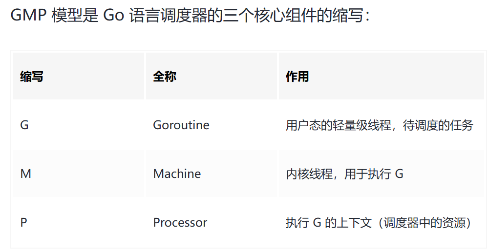
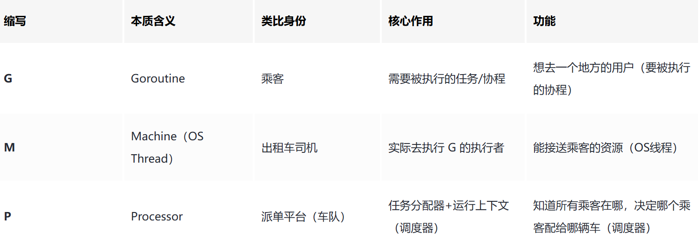
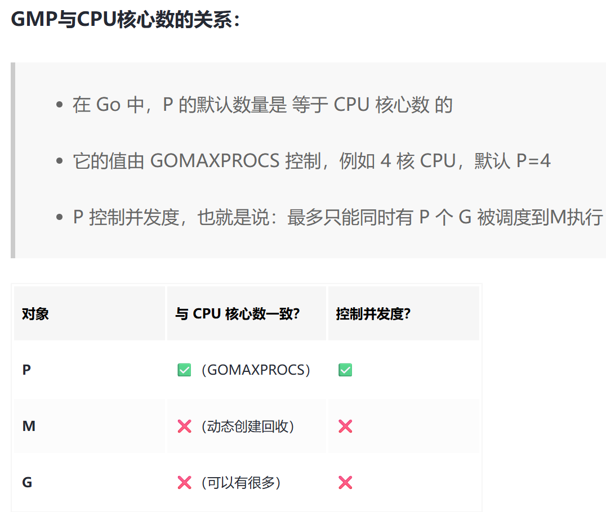

# GMP - Goroutine Machine Processor

## 前言
Golang 的 GMP 调度模型 是 Go 语言运行时（runtime）中的核心机制之一，它高效地实现了 高并发协程（goroutine）调度执行，解决了 用户态调度（goroutine）与内核态线程（OS thread）之间的映射问题。

## 一、什么是GMP模型



### GMP模型的作用
将海量的 G（goroutine）以低成本、高效率的方式调度到 M（内核线程）上执行，通过 P（调度器上下文）协调，实现 M 和 G 之间的解耦。





## 二、组成部分详解

### 1. G Goroutine
- 描述一个任务或函数（Goroutine）
- 拥有自己的栈、指令指针、调度状态
- 不直接绑定 OS 线程，轻量、创建开销小
### 2. M Machine
- 对应一个 OS 线程
- 负责执行 G 中的代码
- M 不直接管理 G，执行时需要绑定一个 P
### 3. P Processor
- 核心调度器资源，表示 CPU 上下文（非物理 CPU）
- 每个 P 有自己的 G 队列（本地运行队列）
- Go 程序启动时，P 的数量由 GOMAXPROCS 决定

## 三、GMP调度流程

### 1. 启动阶段
- 启动时初始化多个 P，每个 P 尝试找 M 来绑定运行
- M 必须绑定一个 P 才能执行 G，单独的 M 无法调度 G
### 2. G的创建
- 当用户调用 go func() 时，创建 G（Goroutine）
- G 被加入当前 P 的本地队列或全局队列（满时）
### 3. M 调用 P 执行 G
- M 绑定一个 P，从 P 的队列中取出 G 执行
- G 执行完成或发生阻塞（例如 syscall），M 会进行下一轮调度
### 4. G 被挂起或阻塞（GMP调度模型是如何优雅地应对G阻塞）
- 若 G 调用 syscall 等阻塞操作：
    - M 可能阻塞，P 会被解绑
    - 调度器会创建新 M 来继续执行剩余的 G
### 5. G 的抢占
- 为了防止 G 长时间执行，Go 1.14 起引入 异步抢占，防止“长任务”阻塞调度
- 运行时间长的 G 会被强制抢占，挂起后重新入队
### 6. 调度策略：Work Stealing
- 如果一个 P 的 G 队列空了，会尝试从其他 P 偷一半 G（work stealing）
- 避免某些 P 长期空闲，提升 CPU 利用率

```text
+-------------+       +------------+      +-------------+
|   G1,G2...  | <---> |     P1     | <--> |     M1      |
+-------------+       |  本地队列  |      +-------------+
                      +------------+      ↑ 执行G逻辑    ↓
                                          +-------------+
                                          |     M2      | （阻塞中）
                                          +-------------+

    全局队列  ↔   所有 P 共享（G 多时平衡）
```

## 四、关键调度策略与优化点


## 五、特殊情况处理分析
### 1. M 找不到可用的 G
- 尝试从本地队列取 G
- 如果本地队列为空，尝试：
- 从 全局 G 队列 取任务
- 从其他 P 偷任务（Work Stealing）
- 若还是找不到，就将 M 停止（进入空闲）
### 2.G 进行系统调用导致 M 阻塞
- G 阻塞后，M 被挂起，P 被解绑
- runtime 会创建新的 M，将 P 绑定过去继续调度其他 G
- 原阻塞 M 等待 syscall 完成后再回归
### 3.没有足够的 M 可用（如高并发）
- Go runtime 有一个 M 的最大上限（默认 10,000）
- 超过后会排队等候，防止线程资源耗尽
### 4.GC（垃圾回收）调度干扰
- GC 会标记 G 状态，暂停一部分 Goroutine
- Go 实现了 STW（stop the world）阶段的优化，减少调度阻塞
### 5.goroutine 爆炸（G 数量极多）
- 可能导致本地队列、全局队列频繁切换
- Go 内部通过“调度阈值”等机制控制调度频率

## 六、调度状态枚举（G 的状态）


## 七、GMP总结


## 八、补充：如果 M在P的队列内找不到G来执行，会发生什么（详解）
### 1. 场景还原

- 设想以下情况：
  - M1 已经绑定了 P1
  - P1 的 本地 G 队列是空的
  - M1 正在尝试从队列中拿 Goroutine 来执行

### 2. 调度器的应对步骤（按优先顺序）
- 检查全局 G 队列
  - 如果 P1 本地队列为空，调度器会先查看 全局 G 队列（global run queue） 是否有 G 可执行
  - 如果有，从全局队列获取一些 G（默认最多抢 61 个），加入本地队列，然后执行其中一个
- Work Stealing（从其他 P 偷 G）
  - 如果全局队列也空，调度器会随机选择一个其他的 P，尝试从它的本地队列中“偷” 一半的 G
  - 如果偷到了，把偷到的一半 G 放到自己的 P1 的队列中，然后执行其中一个
- 如果真的找不到任何 G：
  - 此时，进入 “找不到活干”的处理逻辑 👇

### 3. 没有 G 可执行时的最终处理流程

- 🧘‍♂️ M 进入休眠（park）
  - 如果找不到任何 G（本地、全局、其他 P 全都没有），则当前 M 会调用 runtime.park()
  - M 就此进入休眠状态，不占用 CPU
- 🗄 P 会保持空闲（进入 idle 状态）
  - 当前绑定的 P 会继续空转等待新的 G 进入队列（例如其他线程创建 goroutine）
  - 此时它仍然是活动状态，只是处于 idle
- 🔔 后续触发机制：唤醒 M
  - 一旦新的 G 被创建（通过 go 关键字），会被加入某个 P 的队列中
  - 如果该 P 没有绑定正在运行的 M，则会从 空闲 M 池中唤醒一个 M 来绑定这个 P
  - 重新进入调度循环

### 4. 完整流程图解

```text   
┌────────────┐
│ M 绑定了 P │
└────┬───────┘
     ↓
┌────────────┐
│ P 本地队列空│
└────┬───────┘
     ↓
┌────────────┐
│ 查全局队列 │───┐
└────┬───────┘   │（有G→执行）
     ↓           │
┌────────────┐   │
│ Work Steal │───┘
└────┬───────┘
     ↓
┌────────────┐
│ 无 G 可执行 │
└────┬───────┘
     ↓
┌────────────┐
│ M 进入休眠 │
└────┬───────┘
     ↓
┌───────────────┐
│ 等待有新 G 创建 │←────┐
└───────────────┘     │
                      │（go func()）
                      ↓
               ┌────────────┐
               │ 唤醒空闲 M │
               └────────────┘

```

### 5. 意义
- 高效节能：当无任务时 M 自动休眠，不浪费 CPU
- 资源复用：M 和 G 都可复用，避免频繁创建销毁系统线程
- 响应及时：有新任务时能快速唤醒 M，响应调度
- 负载均衡：work stealing 实现多核协同


go lifecycle

1. 当程序启动时，程序会根据GOMAXPROCS环境变量的值来决定启动的P的数量
2. 此时创建一个goroutine协程，处于runable状态。并将其加入当前创建该G的P队列。
如果队列满了，则会放入全局队列。
3. 每一个M都需要绑定一个P，用来执行G。M在切换G时，先切换到g0然后才会切换到P中的G
4. 空闲的P会从全局队列中获取G来执行，当全局队列为空时

G的生命周期
1 goroutine通过go关键字创建出来 
状态由_Gidle->_Grunnable (从“空壳”到“准备就绪”）
当goroutine因为互斥锁或者读写channel阻塞时，
g的状态从_Grunning ->_Gwaiting (从“执行”到“等待资源”）
g的指针会移到对应的等待g链表里，
比如channel内部就为读阻塞和写阻塞分别维护了两个g指针链表
这些goroutine等待的事件触发之后 
他们会由_Gwaiting -> Grunnable (从“等待”到“重新排队”)
2 这些情况要不就是新建一个可运行的g 
要不就是唤醒一个可运行的g 
他们都会调用ready函数
这个函数会优先把他们放在当前执行这个任务的g所在的p本地队列的runnext字段

3并且会在这里检查一次是否有空闲的p没有被线程绑定之前举了四种情况的例子 
能感受到 当有新的任务出现空闲的p就应该被唤醒来工作 
尽可能利用多个cpu核心

4 当本地队列不足时 去全局队列取任务 
当本地队列和全局队列都没有任务
且netpollio也没有任务就去窃取某个随机p的一半任务

5 当某个goroutine触发系统调用 
线程m会和p解绑标记p为空闲 
并且把他加入到空闲p队列链表里
和当前g一同陷入到阻塞(持有这个g指针这个g的指已经不在p本地队列的逻辑头尾指针之间是无效的)

6 系统调用返回后 
m在当前持有的g栈内执行函数寻原先p 
失败则切换到g0寻找任意空闲p成功的话就可回到gmp调度流程

7都失败则把当前g放到全局队列供其他活跃的m-p组调度，直到自己的本地队列执行，自身陷入休眠等待调度