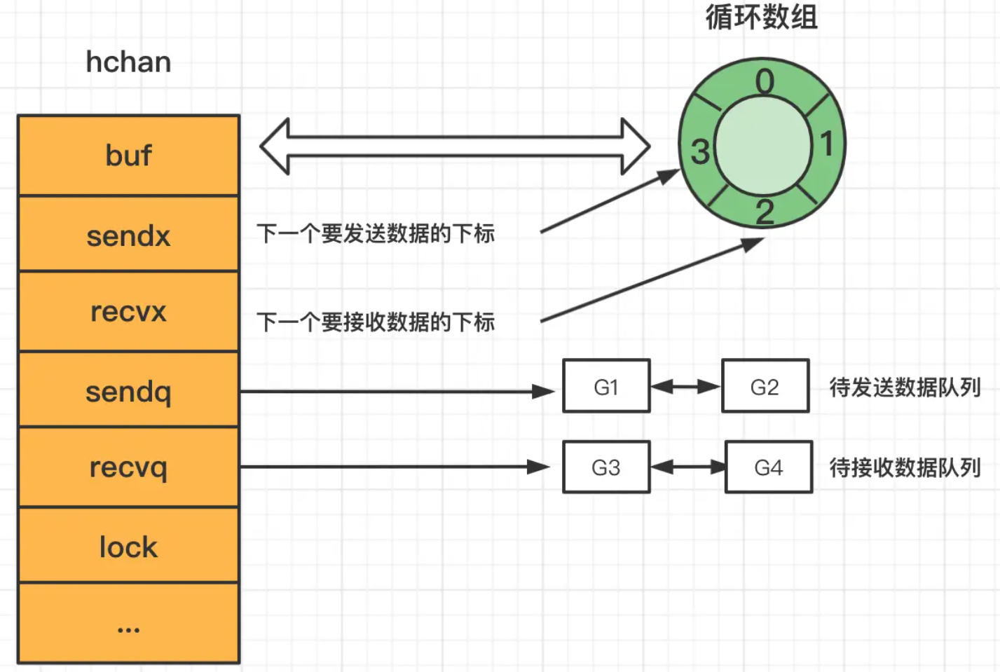

# Channel实现原理

## 数据结构
Go 语言的 Channel 在运行时使用 runtime.hchan 结构体表示。我们在 Go 语言中创建新的 Channel 时，实际上创建的都是如下所示的结构：

```go
type hchan struct {
//channel分为无缓冲和有缓冲两种。
//对于有缓冲的channel存储数据，借助的是如下循环数组的结构
qcount   uint           // 循环数组中的元素数量
dataqsiz uint           // 循环数组的长度
buf      unsafe.Pointer // 指向底层循环数组的指针
elemsize uint16 //能够收发元素的大小


closed   uint32   //channel是否关闭的标志
elemtype *_type //channel中的元素类型

//有缓冲channel内的缓冲数组会被作为一个“环型”来使用。
//当下标超过数组容量后会回到第一个位置，所以需要有两个字段记录当前读和写的下标位置
sendx    uint   // 下一次发送数据的下标位置
recvx    uint   // 下一次读取数据的下标位置

//当循环数组中没有数据时，收到了接收请求，那么接收数据的变量地址将会写入读等待队列
//当循环数组中数据已满时，收到了发送请求，那么发送数据的变量地址将写入写等待队列
recvq    waitq  // 读等待队列
sendq    waitq  // 写等待队列


lock mutex //互斥锁，保证读写channel时不存在并发竞争问题
}
```



总结hchan结构体的主要组成部分有四个：

- 用来保存goroutine之间传递数据的循环链表。=====> buf。
- 用来记录此循环链表当前发送或接收数据的下标值。=====> sendx和recvx。
- 用于保存向该chan发送和从改chan接收数据的goroutine的队列。=====> sendq 和 recvq
- 保证channel写入和读取数据时线程安全的锁。 =====> lock


## 数据流程
- 假设G1生产者，G2消费者
- 初始hchan结构体的buf为空，sendx和recvx都为0
- G1发送数据时，会将buf加锁。然后将数据copy到buf（buf[sendx]）中，然后更新sendx的值为(sendx+1)%cap(buf)，最后释放buf
- G2接收数据时，会将buf加锁。然后将数据copy到对应任务的变量地址中，然后更新recvx++，最后释放buf

可以发现整个过程，G1和G2没有共享的内存，底层是通过hchan结构体的buf，
并使用copy内存的方式进行通信，最后达到了共享内存的目的，
这里也体现了Go中的CSP并发模型，
（PS: Copy 可以防止数据在传输过程中被意外或恶意修改。如果某个 
goroutine 在发送数据同时修改了数据，那么接收方得到的可能是篡改后的数据。
通过将数据 copy 到channel，然后再 copy 到接收 goroutine，
可以确保数据在传输过程中不会被修改。）。

## 主要问题

### 向缓存满的channel写数据会发生什么？
- 当G1向buf已经满了的ch发送数据的时候，
检测到hchan的buf已经满了，会通知P，P会将G1的状态设置为waiting, 
并移除与线程M的联系，然后从P的runqueue中选择一个goroutine在线程M中执行，
此时G1就是waiting状态，但是不是操作系统的线程阻塞，所以这个时候只用消耗少量的资源。
- 当G1变为waiting状态后，会创建一个代表自己的sudog的结构，
然后放到sendq这个list中，sudog结构中保存了channel相关的变量的指针
(如果该Goroutine是sender，那么保存的是待发送数据的变量的地址，
如果是receiver则为接收数据的变量的地址，之所以是地址，
前面我们提到在传输数据的时候使用的是copy的方式)
- 当G2从ch中接收一个数据时，会通知P，设置G1的状态为runnable，然后将加入P的runqueue里，等待线程执行

### 从缓存为空的channel读数据会发生什么？

- 如果G2先运行，那么G2会从一个empty的channel里取数据，
这个时候G2就会阻塞，和前面介绍的G1阻塞一样，G2也会创建一个sudog结构体，
保存接收数据的变量的地址，但是该sudog结构体是放到了recvq列表里。
- 当G1向ch发送数据的时候，为了提升效率，
runtime并不会对hchan结构体题的buf进行加锁，
而是直接将G1里的发送到ch的数据copy到了G2 sudog里对应的elem指向的内存地址！【不通过buf】
