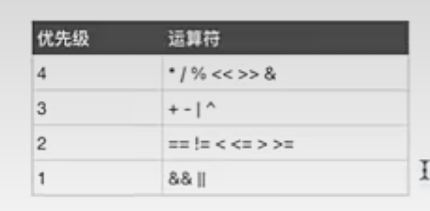

# 1.7 运算操作符

# 1.7.1 算术运算符

go 中，两个整数计算，它们计算之后的结果也还是整数。

代码示例：

```go
a, b := 1, 2
sum := a + b
sub := a - b
mul := a * b
div := a / b
mod := a % b

fmt.Println(sum, sub, mul, div, mod)
```

另外，自增与自减只能以 `<var name>++` 或者 `<var name>--` 的模式声明，并且只能单独存在，不能在自增或自减的同时做加减乘除的计算：

```go
a := 1
// 正确写法
a++
a--

// 错误的使用方式
++a
--a

// 错误使用方式，不可以自增时计算,也不能赋值
b := a++ + 1
c := a--
```

当不同的数字类型混合计算时，必须先把它们转换成同一类型才可以计算：

```go
a := 10 + 0.1
    b := byte(1) + 1
    fmt.Println(a, b)

    sum := a + float64(b)
    fmt.Println(sum)

    sub := byte(a) - b
    fmt.Println(sub)

    mul := a * float64(b)
    div := int(a) / b

    fmt.Println(mul, div)
```

# 1.7.2 关系运算符

关系运算符结果只会是 bool 类型。

```go
a := 1
b := 5

fmt.Println(a == b)
fmt.Println(a != b)
fmt.Println(a > b)
fmt.Println(a < b)
fmt.Println(a >= b)
fmt.Println(a <= b)
```

# 1.7.3 逻辑运算符

代码示例：

```go
a := true
b := false

fmt.Println(a && b)
fmt.Println(a || b)
fmt.Println(!(a && b))
```

# 1.7.4 位运算符

位运算结果：

代码示例：

```go
fmt.Println(0 & 0)
fmt.Println(0 | 0)
fmt.Println(0 ^ 0)

fmt.Println(0 & 1)
fmt.Println(0 | 1)
fmt.Println(0 ^ 1)

fmt.Println(1 & 1)
fmt.Println(1 | 1)
fmt.Println(1 ^ 1)

fmt.Println(1 & 0)
fmt.Println(1 | 0)
fmt.Println(1 ^ 0)
```

# 1.7.5 赋值运算符

代码示例：

```go
func main() {
    a, b := 1, 2
    var c int
    c = a + b
    fmt.Println("c = a + b, c =", c)

    plusAssignment(c, a)
    subAssignment(c, a)
    mulAssignment(c, a)
    divAssignment(c, a)
    modAssignment(c, a)
    leftMoveAssignment(c, a)
    rightMoveAssignment(c, a)
    andAssignment(c, a)
    orAssignment(c, a)
    norAssignment(c, a)
}

func plusAssignment(c, a int) {
    c += a // c = c + a
    fmt.Println("c += a, c =", c)
}

func subAssignment(c, a int) {
    c -= a // c = c - a
    fmt.Println("c -= a, c =", c)
}

func mulAssignment(c, a int) {
    c *= a // c = c * a
    fmt.Println("c *= a, c =", c)
}

func divAssignment(c, a int) {
    c /= a // c = c / a
    fmt.Println("c /= a, c =", c)
}

func modAssignment(c, a int) {
    c %= a // c = c % a
    fmt.Println("c %= a, c =", c)
}

func leftMoveAssignment(c, a int) {
    c <<= a // c = c << a
    fmt.Println("c <<= a, c =", c)
}

func rightMoveAssignment(c, a int) {
    c >>= a // c = c >> a
    fmt.Println("c >>= a, c =", c)
}

func andAssignment(c, a int) {
    c &= a // c = c & a
    fmt.Println("c &= a, c =", c)
}

func orAssignment(c, a int) {
    c |= a // c = c | a
    fmt.Println("c |= a, c =", c)
}

func norAssignment(c, a int) {
    c ^= a // c = c ^ a
    fmt.Println("c ^= a, c =", c)
}
```

# 1.7.6 其他运算符

```go
func main() {
    a := 4
    var ptr *int
    fmt.Println(a)

    ptr = &a
    fmt.Printf("*ptr 为 %d\n", *ptr)
}
```

# 1.7.7 运算优先级

代码示例：

```go
func main() {
    var a int = 21
    var b int = 10
    var c int = 16
    var d int = 5
    var e int

    e = (a + b) * c / d // ( 31 * 16 ) / 5
    fmt.Printf("(a + b) * c / d 的值为 : %d\n", e)

    e = ((a + b) * c) / d // ( 31 * 16 ) / 5
    fmt.Printf("((a + b) * c) / d 的值为  : %d\n", e)

    e = (a + b) * (c / d) // 31 * (16/5)
    fmt.Printf("(a + b) * (c / d) 的值为  : %d\n", e)

    // 21 + (160/5)
    e = a + (b*c)/d
    fmt.Printf("a + (b * c) / d 的值为  : %d\n", e)

    // 2 & 2 = 2; 2 * 3 = 6; 6 << 1 = 12; 3 + 4 = 7; 7 ^ 3 = 4;4 | 12 = 12
    f := 3 + 4 ^ 3 | 2&2*3<<1
    fmt.Println(f == 12)
}
```

注：可以使用小括号，提高部分计算的优先级。也可以提高表达式的可读性。