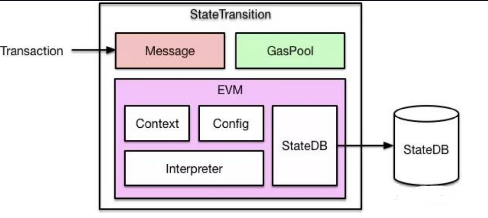
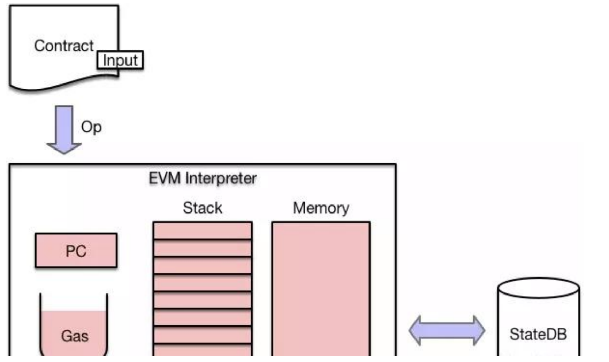
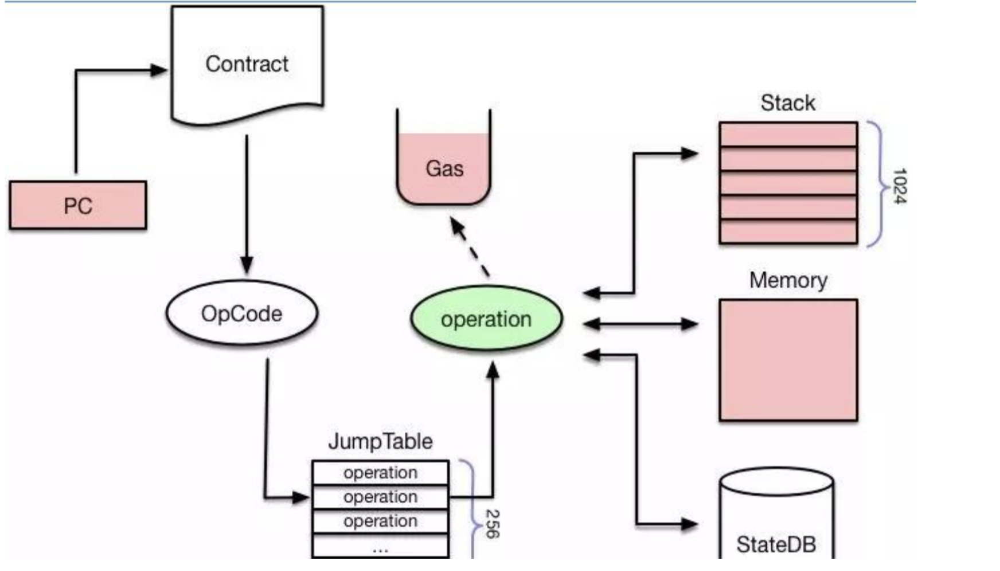

调用函数发生了啥
假如我们用钱包账户调用了合约的一个 function，那么这个 function 的执行过程是怎样的？




让我根据这张图详细解释合约函数的执行流程：
1. Transaction 交易输入
```
Transaction {
    from: 钱包地址,
    to: 合约地址,
    value: 转账金额,
    data: 函数选择器 + 参数,
    gasLimit: Gas上限,
    gasPrice: Gas价格,
    nonce: 交易序号
}
```

3. Message 层处理
- 验证交易基本信息
- 签名验证
- nonce 检查
- 基本格式验证
- 创建 Message 对象
```
Message {
      sender: msg.sender,
      recipient: to,
      value: msg.value,
      data: 调用数据,
      gas: gasLimit
  }
```

3. GasPool 处理
-  预扣除交易费用
- 跟踪 gas 使用情况
- 确保 gas 限制在区块范围内
- 准备 gas 退款机制

4. EVM 执行环境准备
```
// Context 上下文
Context {
    blockNumber: 当前区块号,
    timestamp: 时间戳,
    coinbase: 矿工地址,
    difficulty: 难度值,
    gasLimit: 区块gas限制
}

// Config 配置
Config {
    chainId: 链ID,
    homesteadBlock: 硬分叉配置,
    byzantiumBlock: 硬分叉配置,
    // ... 其他配置
}
```

5. StateDB 交互
- 初始状态读取
```
 // 读取合约状态
  StateDB.getState(contractAddress) {
      code: 合约代码,
      storage: 存储数据,
      balance: 余额,
      nonce: 交易计数
  }
```

6. Interpreter 解释执行
```
Interpreter {
    // 1. 函数选择器匹配
    bytes4 selector = msg.data[0:4];
    
    // 2. 参数解码
    params = abi.decode(msg.data[4:]);
    
    // 3. 执行操作码
    while (有操作码) {
        执行当前操作码;
        更新程序计数器;
        检查 gas 消耗;
    }
    
    // 4. 状态更新
    StateDB.updateState(changes);
}
```

7. StateDB 状态更新
```
// 写入新状态
StateDB.commit() {
    更新账户状态;
    更新存储数据;
    计算新的状态根;
    持久化数据;
}
```

这个执行流程展示了从交易输入到最终状态更新的完整过程，每个组件都有其特定的职责：
1. Message 处理交易的基本验证和封装
2. GasPool 管理执行资源
3. EVM 提供执行环境
4. StateDB 负责状态管理
5. Interpreter 执行具体的合约代码


StateDB 的基本结构

1. MPT (Merkle Patricia Trie) 树结构
```
StateDB
├── World State Trie (全局状态树)
│   ├── Account1 (地址 -> 账户状态)
│   │   ├── nonce
│   │   ├── balance
│   │   ├── storageRoot -> Storage Trie
│   │   └── codeHash
│   │
│   └── Account2
│       ├── nonce
│       ├── balance
│       ├── storageRoot -> Storage Trie
│       └── codeHash
│
└── Storage Tries (存储树)
    ├── Contract1 Storage
    │   ├── slot0 -> value0
    │   ├── slot1 -> value1
    │   └── slot2 -> value2
    │
    └── Contract2 Storage
        ├── slot0 -> value0
        └── slot1 -> value1
```
2. 存储位置计算
```
// 1. 账户状态位置
address -> keccak256(address) -> Account State

// 2. 合约存储位置
slot -> keccak256(slot) -> Storage Value

// 3. 映射存储位置
mapping(key => value)
key -> keccak256(key + slot) -> value

// 4. 动态数组存储位置
array[index] -> keccak256(slot) + index -> value
```
关键特点

3. 树形结构
- 每个区块都有自己的状态根
- 支持快速验证和回滚
- 支持增量更新

4. 存储效率
- 只存储修改的路径
- 共享未修改的节点
- 支持默克尔证明

5. 安全性
- 任何修改都会改变根哈希
- 可以验证任何状态的完整性
- 支持轻客户端验证


关注于数据
合约中的数据都存储在哪？
```solidity
// SPDX-License-Identifier: MIT
pragma solidity ^0.8.0;

contract ExampleContract {
    // 状态变量（存储在 storage => stateDB）
    uint256 public stateVar = 100;
    mapping(address => uint256) public balances;
    uint256[] someStorageArray;
    
     // 常量（编译时确定，在字节码中）
    uint256 public constant CONSTANT_VAR = 1000;
    
    // immutable（部署时确定，在代码区）
    uint256 public immutable IMMUTABLE_VAR;
    
    // 部署的时候 调用的
    constructor() {

        IMMUTABLE_VAR = 500;
    }
    
    

    function testMemory() public pure returns(string memory) {

        return "testMemory";
    }
    
    function claimVar() public view returns (uint256) {
        
        //  === 存在 memory
        uint256[] memory memoryArray = new uint256[](3);
        string memory str = "Hello";
        bytes memory tempBytes = new bytes(10);
        // ===
        
        // ====  存在 stack
        uint256 stackVar = 123;
        bool flag = true;
        address sender = msg.sender;
        uint8 smallNum = 255;
        // ===
        
        // === storage 指针 指向 stateDB
        uint256[] storage storageArray = someStorageArray;
        mapping(address => uint256) storage storageMap = balances;
        

        TempStruct memory tempStruct = TempStruct({
            value: 100,
            name: "Test"
        });
        
        // 6. 循环中的变量（栈上）
        for (uint8 i = 0; i < 3; i++) {
            uint256 loopVar = i * 2;
            memoryArray[i] = loopVar;
        }
        
        return stackVar;
    }
   
    
   
    // 纯函数中的变量（全部在栈上）
    function pureFunction(uint256 x) public pure returns (uint256) {
        uint256 y = x * 2;
        return y;
    }

    // sload 操作 
    function viewFunction() public view returns (uint256) {
        return stateVar;
    }
    
    // 引用传递示例  
    function referenceExample(uint256[] memory inputArray) public {
        // memory 到 memory 的引用
        uint256[] memory localArray = inputArray;
        
        // storage 引用 sload => someStorageArray， sstore 操作 修改了 stateDB的 someStorageArray
        someStorageArray.push(100);
    }

    struct TempStruct {
        uint256 value;
        string name;
    }

    function memoryTempStruct(string calldata name, uint val) public view returns(TempStruct memory) {

        // name = string.concat(name, "abc");

        TempStruct memory ts = TempStruct({
            name: name,
            value: val
        });
        return ts;
    }

    function _call(TempStruct calldata ts) public pure returns (TempStruct memory) {
        return ts;
    }

    // memory 可以基于 calldata 得到
    // calldata不能在函数声明
    // https://remix-ide.readthedocs.io/zh-cn/latest/udapp.html  结构体传参交互
    function calldataTempStruct(TempStruct calldata ts) external view returns (TempStruct memory) {

        // ts.name = "qaq";

        // TempStruct memory ts2 = ts;
        // return ts2;
        // TempStruct calldata ttt = TempStruct(12, "zood");
        return _call(ts);

        //  ts;

    }

    // function _call(TempStruct calldata ts) internal  view returns (TempStruct memory) {
    //     TempStruct memory ts2 = ts;
    //     return  ts2;
    // }
    

    
}
```
```
运行时代码结构：
[
    常量
    +
    函数选择器逻辑
    +
    各函数的实现代码
    +
    immutable 变量存储区域  
]
```




pure、view 和 默认
三者的区别：


问题：solidity的设计中为什么要增加这两个函数修饰符？
帮助开发者实现预期的函数
比如不希望 这个函数额外去 读取或者 写入 数据造成额外的gas消耗，那就 用 pure 作为限制，确保写出来的代码 不会去做这个事情

calldata、memory 和 storage
作用于 函数、以及内部变量声明

Solidity 为什么要设计这3个修饰符？
Evm 的 设计 决定了  stack、memory 和 stateDB 这三个对象，而且他们的 gas 消耗、性能什么的都不一样。
Solidity 是给 开发者 一个 比较符合 人机工程的 语法，让开发者能够 对这块操作进行一个优化

1. Storage
- 特点：永久存储在区块链上 stateDB
- Gas成本：最高
- 使用场景：合约状态变量、函数内部变量声明
- 类比：类似计算机的硬盘存储


2. Memory
- 特点：临时存储，函数执行完即销毁
- Gas成本：中等
- 使用场景：函数参数、返回值、函数内部变量声明
- 类比：计算机的内存


3. Calldata
- 特点：临时存储，只读，不可修改 只能用于修饰函数参数，而且主要用于 external 函数。
- Gas成本：最低
- 使用场景：外部函数的参数、函数返回（直接返回calldata参数）
- 类比：只读内存